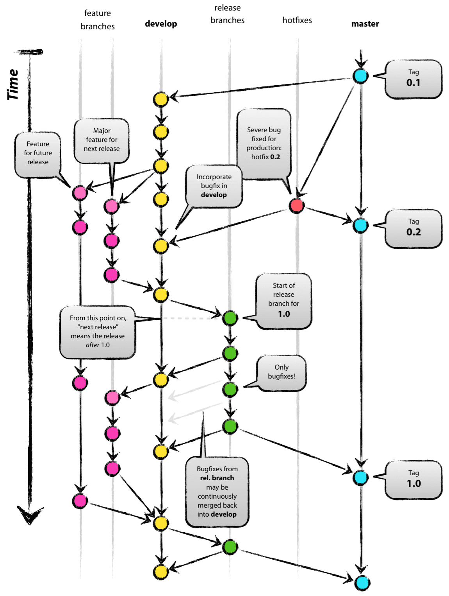

# git-flow

**형상 관리 전략**으로 다음과 같은 **장점**이 있다.

소스 코드 관리를 효율적으로 할 수 있다.

협업 시 발생할 수 있는 문제점을 최소화 할 수 있다.

브랜치를 통해 프로젝트를 관리하며 브랜치는 총 5개로 구분한다.

---

### **master branch**

**배포됐거나 배포될 소스**를 저장하는 브랜치

배포 될 때마다 태그만 달아주는 형식으로 관리를 한다.

- 배포 버전에 태그를 달아 원하는 버전의 소스를 받아볼 수 있다.

 

### **develop branch**

배포하기 위해 **여러명의 개발자가 함께** 개발을 진행하는 브랜치

기능들을 분배해 개발자들 본인의 로컬에 브랜치(`feature branch`)를 생성해 개발을 진행하고 완료된 소스가 `develop branch`로 푸시된다.

- develop으로 merge되기 전 코드리뷰가 진행된다.

 

### **feature branch**

**추가할 기능**을 개발하는 브랜치

보통의 경우 로컬에 설치되며 개발자들의 합의 하에 원격에 설치해도 된다.

- 예를 들어 회원가입 기능을 개발해야 한다면 `feature branch` 안에서 도메인 생성, db연동 등의 커밋이 진행된 후 기능 구현이 완료되면 `develop branch`로 이동한다.

 

### **hotfixs branch**

**배포된 버전에 생긴 문제로** 긴급한 트러블슈팅이 필요할 때의 브랜치

`develop branch`는 다음에 배포될 버전이므로 건드리면 안된다. 이때 `master branch`에서 따로 hotfix 브랜치를 만들고 문제를 고쳐 `master branch`에 merge한다.

`master branch` 수정 후 `develop branch`도 적용해야 한다.

 

### **release branch**

배포되기 전에 테스트를 거치는 소스가 저장되는 브랜치

QA중 문제가 발생하면 버그픽스를 진행하고 버그가 제거된 release 소스를 develop 브랜치에 적용해서 개발을 이어나간다.

## git-flow

